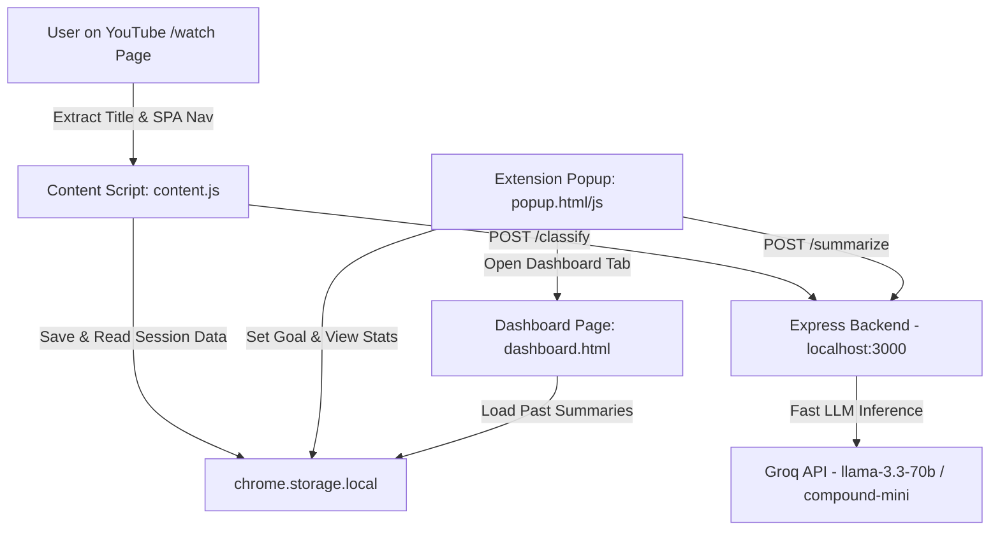

# FocusTube 🎯  
*AI-Powered Focus Assistant for YouTube*


FocusTube is an intelligent, Manifest V3 Chrome Extension designed to eliminate YouTube distraction rabbit holes. By leveraging the **Groq AI API** (`llama-3.3-70b-versatile` / `groq/compound-mini`), FocusTube detects what you are watching in real time, evaluates whether it matches your session goal, and gently keeps you on track with in-page banners, distraction nudges, and focus analytics.

---

## 💡 The Problem FocusTube Solves

YouTube is one of the greatest learning platforms in the world—and also the biggest productivity sink. Algorithms continuously recommend seductive, off-topic videos that hijack your attention. 

**FocusTube** acts as a gentle AI co-pilot:
- You set a session goal (e.g. *"I want to learn system design architecture"*).
- As you browse YouTube, FocusTube evaluates each video's title using Groq's high-speed LLM inference.
- If you wander off-topic, an in-page warning banner reminds you of your goal.
- If you stay on an off-topic video for over 2 minutes, a smart distraction nudge alerts you to return to your goal.

---

## ✨ Features

- 🎯 **Session Goal Setting**: Define what you want to learn before starting your YouTube session.
- 🤖 **Groq AI Real-Time Classification**: Sub-second LLM classification determining if videos are `On-Topic` or `Off-Topic`.
- ⚠️ **In-Page Floating Warning Banners**: Non-intrusive floating badges positioned safely below the YouTube header with 10s auto-dismiss and explicit **Dismiss** controls.
- ⏰ **2-Minute Smart Distraction Alert**: Pulsing notification triggered if an off-topic video plays past 2 minutes.
- 📊 **Real-Time Focus Score Analytics**: Live Focus Score percentage gauge (`80% Focus Rate`) with color indicators (Green ≥80%, Amber 50-79%, Red <50%) and real-time storage sync.
- 📝 **AI Session Summaries**: Click **End Session** to receive a Groq AI evaluation summarizing your total time, focus score, top distraction category, and motivational feedback.
- 📈 **Weekly Focus Dashboard (`dashboard.html`)**: Standalone dark-mode dashboard featuring a 7-session HTML/CSS focus score trend bar chart and past session history cards.
- ⚡ **0ms Latency Memory Caching**: In-memory response caching on both server and content script for instant evaluation of repeated video titles.

---

## 🏗️ Architecture



---

## 🛠️ Tech Stack

- **Frontend**: Plain HTML5, Vanilla CSS3 (Dark Glassmorphism UI tokens), Vanilla JavaScript (ES6+ async/await).
- **Chrome Extension API**: Manifest V3, `chrome.storage.local`, `chrome.storage.onChanged`, `chrome.tabs`, `chrome.runtime`.
- **Backend Service**: Node.js, Express.js, CORS, Dotenv.
- **AI & Inference**: Groq SDK (`groq-sdk`), `groq/compound-mini` / `llama-3.3-70b-versatile`.

---

## 🚀 Quickstart & Setup Guide

### Prerequisites
- [Node.js](https://nodejs.org/) (v18+)
- A free [Groq API Key](https://console.groq.com/)

### 1. Clone & Install Backend
```bash
git clone https://github.com/your-username/FocusTube.git
cd FocusTube/server
npm install
```

### 2. Configure Environment Variables
Copy `.env.example` to `.env` inside the `server/` directory:
```bash
cp .env.example .env
```
Edit `server/.env` and add your Groq API key:
```env
PORT=3000
GROQ_API_KEY=gsk_your_actual_groq_api_key
```

### 3. Start the Express Server
```bash
npm start
```
*The server will run on `http://localhost:3000`.*

### 4. Load Extension in Google Chrome
1. Open Google Chrome and navigate to `chrome://extensions`.
2. Enable **Developer mode** using the toggle switch in the top-right corner.
3. Click **Load unpacked**.
4. Select the root `FocusTube/` directory.

---

## 📁 Project Structure

```text
FocusTube/
├── manifest.json         # Manifest V3 extension configuration
├── popup.html            # Extension popup HTML
├── popup.css             # Glassmorphism dark mode design system
├── popup.js              # Popup controller & real-time stats sync
├── content.js            # YouTube content script, title extraction & banner injection
├── dashboard.html        # Weekly Focus Dashboard page
├── dashboard.js          # Dashboard trend chart & history renderer
├── demo.gif              # Demo preview animation
├── README.md             # Project documentation
├── .gitignore            # Git ignore rules
├── icons/                # Extension PNG icons (16px, 48px, 128px)
└── server/               # Express backend classification service
    ├── server.js         # Express server & Groq AI endpoints (/classify, /summarize)
    ├── package.json      # Server dependencies
    ├── .env.example      # Environment variable template
    └── .gitignore        # Server git ignore rules
```

---

## 🤝 License

Distributed under the MIT License. See `LICENSE` for more information.
